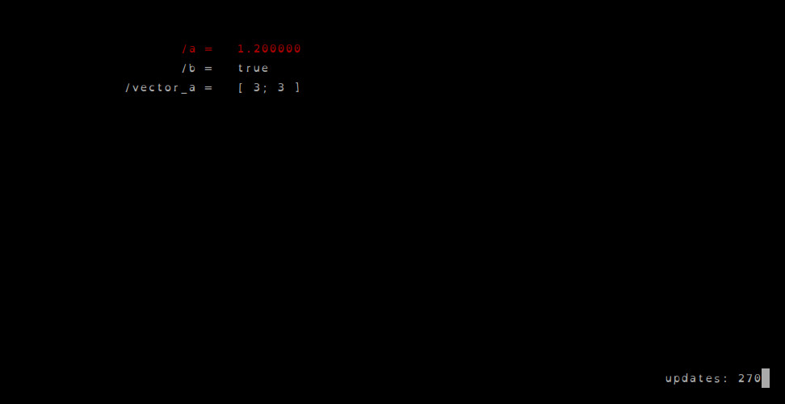
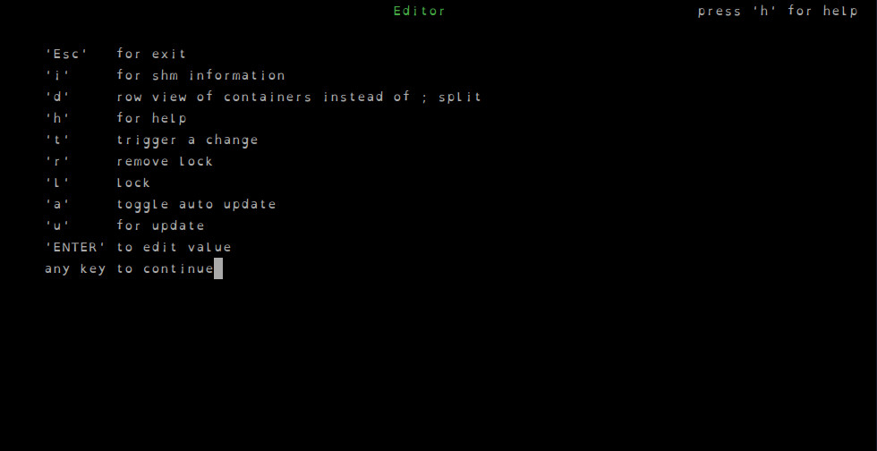

# tuw_shmfw

A very small C++ library for creating shared memory variables that let a
running program's internal state be inspected and changed from the outside, without stopping or recompiling it.

It can be used instead of ROS 2 parameters to modify variables at runtime,
but with precautions: unlike parameters, shared memory segments have no
access control, no automatic cleanup if a process crashes without releasing
the segment, and no discovery/introspection through standard ROS tooling.

Wrap a variable or `std::vector` in a `ShmFw::Var<T>` / `ShmFw::Vector<T>`, and it becomes visible in a shared memory segment under a name of your choosing. Any other process — including the bundled `shmfw_admin` and `shmfw_editor` tools — can then list, read, and modify that value at runtime.

## Features

- Header-only style wrappers (`ShmFw::Var<T>`, `ShmFw::Vector<T>`) around
  values living in a Boost.Interprocess managed shared memory segment
- Automatic timestamping and optional locking per variable
- Type introspection (type name/hash, container kind) so generic tools can
  read and print variables without knowing their C++ type at compile time
- `shmfw_admin` — lists all variables in a shared memory segment, with their
  type, lock state, timestamp, and value
- `shmfw_editor` — an ncurses TUI for live-viewing and editing variables in a
  running segment
- `std::chrono::system_clock::time_point` supported directly as a variable
  type

This is a [ROS 2](https://docs.ros.org/) package built with `ament_cmake`. It
has no dependency on ROS message/service types or `rclcpp` — the shared
memory library itself is plain C++ — but it's built and installed with
`colcon`/`ament_cmake` so it can live in a ROS 2 workspace, be resolved by
`rosdep`, and its tools can be launched with `ros2 run`.

## Usage

### Using a shared variable

See [`examples/usage_var.cpp`](examples/usage_var.cpp):

```cpp
#include <tuw_shmfw/variable.hpp>

ShmFw::HandlerPtr shmHdl = ShmFw::Handler::create("shared_memory_name", 65536);

ShmFw::Var<double> a("a", shmHdl);
a.set(5.4);
std::cout << a << std::endl;
*a.get() = 1.2;
```

### Using a shared vector

See [`examples/usage_vector.cpp`](examples/usage_vector.cpp):

```cpp
#include <tuw_shmfw/vector.hpp>

ShmFw::HandlerPtr shmHdl = ShmFw::Handler::create("shared_memory_name", 65536);

ShmFw::Vector<double> a("vector_a", shmHdl);
a.clear();
a->push_back(1.23);
```

Run the examples with `ros2 run tuw_shmfw shmfw_usage_var` /
`ros2 run tuw_shmfw shmfw_usage_vector` (or call the installed binaries in
`install/tuw_shmfw/lib/tuw_shmfw/` directly).

### Inspecting a segment: shmfw_admin

```bash
ros2 run tuw_shmfw shmfw_admin -m shared_memory_name --context --type --timestamp
```

Lists every variable in the segment along with its lock state and, with the
flags above, its value, type, and last-update time. Pass `-c` / `--clear` to
remove the segment entirely.

### Editing variables live: shmfw_editor

```bash
ros2 run tuw_shmfw shmfw_editor -m shared_memory_name
```

Opens an ncurses view of the segment's variables (or a specific subset given
via `-n`). Navigate with the arrow keys, press `Enter` to edit a value, `l`/`r`
to lock/unlock, `t` to trigger a change notification, and `h` for the full key
list.

 

## License

BSD 3-Clause, see [LICENSE](LICENSE).
